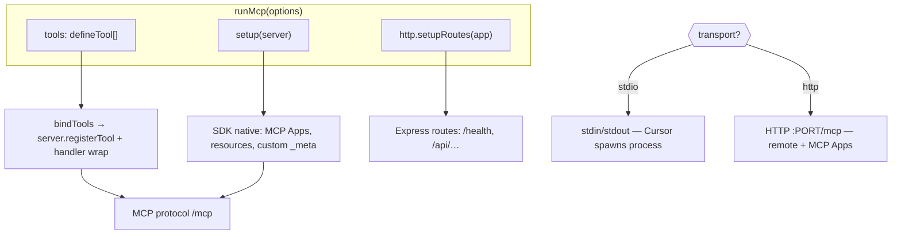

# @achmadya-dev/mcp-core

Shared MCP SDK wrapper for `@achmadya-dev` servers: stdio and Streamable HTTP transport, tool registration, JSON-safe responses, and env helpers.

Built on **MCP TypeScript SDK v2** (`@modelcontextprotocol/server`). Tool schemas use [Standard Schema](https://standardschema.dev/) — pick any compatible library in your package.

## Install

```bash
pnpm add @achmadya-dev/mcp-core
# plus a Standard Schema library in your MCP package, e.g. zod, valibot, arktype, …
```

Installed automatically as a dependency of `@achmadya-dev/mcp-*-query` servers.

## Quick start (stdio)

Pass a Standard Schema object to `inputSchema` / `outputSchema`. Examples below use Zod; other libraries work the same way.

```bash
pnpm add zod
```

```typescript
import * as z from "zod";
import { defineTool, runMcp } from "@achmadya-dev/mcp-core";

const myTool = defineTool({
  name: "my_tool",
  description: "Does something",
  inputSchema: z.object({
    name: z.string().describe("Item name"),
  }),
  outputSchema: z.object({ ok: z.boolean() }),
  handler: async ({ name }) => ({ ok: true }),
});

await runMcp({ name: "My MCP", version: "1.0.0", tools: [myTool] });
```

Configure in Cursor (stdio — client spawns the process):

```json
{
  "mcpServers": {
    "my-mcp": {
      "command": "npx",
      "args": ["-y", "@achmadya-dev/mcp-my-service"]
    }
  }
}
```

## Architecture

One `runMcp()` call = one MCP instance (one process, one transport).



| Hook | Use for |
|------|---------|
| `tools` | Standard tools from `defineTool` (auto-wrap JSON, `ToolError` → `fail`) |
| `setup(server)` | SDK-native MCP features (`registerAppTool`, resources, custom `_meta`) |
| `http.setupRoutes(app)` | Extra HTTP endpoints on the same port (health, webhooks) |

Need **both stdio and HTTP**? Run **two separate instances** (two processes) — not one `runMcp` with dual transport.

## HTTP transport

Same tools and config — set `transport: "http"` or env `TRANSPORT=http`:

```typescript
await runMcp({
  name: "My MCP",
  version: "1.0.0",
  tools: [myTool],
  transport: "http",
  http: {
    port: 3001,
    path: "/mcp",
    setupRoutes: (app) => {
      app.get("/health", (_req, res) => res.json({ ok: true }));
    },
  },
});
```

Or rely on env (default port `3001` via `PORT`):

```bash
TRANSPORT=http PORT=3001 node dist/index.js
```

Configure in Cursor (remote HTTP):

```json
{
  "mcpServers": {
    "my-mcp": {
      "url": "http://127.0.0.1:3001/mcp"
    }
  }
}
```

## Environment variables

| Variable | Default | Description |
|---|---|---|
| `TRANSPORT` | `stdio` | `stdio` or `http` when `runMcp` has no explicit `transport` |
| `PORT` | `3001` | HTTP listen port (when `transport=http`) |

`runMcp` reads `TRANSPORT` and `PORT` internally when not set in options. For tool-specific config in your package, use `envStr`, `envInt`, `envBool`, `envTrans`.

## Schema libraries

### Valibot

```bash
pnpm add valibot @valibot/to-json-schema
```

```typescript
import * as v from "valibot";
import { toStandardJsonSchema } from "@valibot/to-json-schema";
import { defineTool, runMcp } from "@achmadya-dev/mcp-core";

const myTool = defineTool({
  name: "my_tool",
  description: "Does something",
  inputSchema: toStandardJsonSchema(
    v.object({ name: v.pipe(v.string(), v.description("Item name")) })
  ),
  outputSchema: toStandardJsonSchema(v.object({ ok: v.boolean() })),
  handler: async ({ name }) => ({ ok: true }),
});

await runMcp({ name: "My MCP", version: "1.0.0", tools: [myTool] });
```

### ArkType

```bash
pnpm add arktype
```

```typescript
import { type } from "arktype";
import { defineTool } from "@achmadya-dev/mcp-core";

defineTool({
  name: "my_tool",
  description: "Does something",
  inputSchema: type({ name: "string" }),
  outputSchema: type({ ok: "boolean" }),
  handler: async ({ name }) => ({ ok: true }),
});
```

### Raw JSON Schema

```typescript
import { fromJsonSchema } from "@modelcontextprotocol/server";
import { defineTool } from "@achmadya-dev/mcp-core";

defineTool({
  name: "my_tool",
  description: "Does something",
  inputSchema: fromJsonSchema({
    type: "object",
    properties: { name: { type: "string", description: "Item name" } },
    required: ["name"],
  }),
  handler: async ({ name }) => ({ ok: true }),
});
```

Tools with no parameters: use an empty object schema from your library (e.g. `z.object({})`, `toStandardJsonSchema(v.object({}))`, `type({})`).

## Advanced: resources, prompts, MCP Apps

Use `setup` to register SDK features beyond tools — parameter `server` is already typed via `McpSetupHook`, no SDK import needed for typical cases.

### Resources & prompts

```typescript
import * as z from "zod";
import { defineTool, runMcp } from "@achmadya-dev/mcp-core";

await runMcp({
  name: "My MCP",
  version: "1.0.0",
  tools: [myTool],
  setup(server) {
    server.registerResource(
      "config",
      "config://app",
      { title: "App Config", mimeType: "application/json" },
      async (uri) => ({
        contents: [{ uri: uri.href, text: JSON.stringify({ ok: true }) }],
      }),
    );

    server.registerPrompt(
      "review",
      {
        title: "Code Review",
        argsSchema: z.object({ code: z.string() }),
      },
      ({ code }) => ({
        messages: [{ role: "user", content: { type: "text", text: `Review:\n${code}` } }],
      }),
    );
  },
});
```

### MCP Apps (draw.io inline UI)

For [draw.io MCP App](https://github.com/jgraph/drawio-mcp)-style inline diagrams, install `@modelcontextprotocol/ext-apps` and import helpers from the mcp-core subpath:

```bash
pnpm add @achmadya-dev/mcp-core @modelcontextprotocol/ext-apps zod
```

```typescript
import * as z from "zod";
import { runMcp } from "@achmadya-dev/mcp-core";
import {
  registerAppResource,
  registerAppTool,
  RESOURCE_MIME_TYPE,
} from "@achmadya-dev/mcp-core/ext-apps";

const UI_URI = "ui://drawio/view.html";

await runMcp({
  name: "Draw.io MCP",
  version: "1.0.0",
  tools: [], // UI tools registered in setup via registerAppTool
  transport: "http",
  http: { port: 3001 },
  setup(server) {
    registerAppResource(
      server,
      "Draw.io View",
      UI_URI,
      { mimeType: RESOURCE_MIME_TYPE },
      async () => ({
        contents: [{ uri: UI_URI, mimeType: RESOURCE_MIME_TYPE, text: buildDrawioHtml() }],
      }),
    );

    registerAppTool(
      server,
      "create_diagram",
      {
        description: "Render a draw.io diagram inline",
        inputSchema: z.object({ xml: z.string() }),
        _meta: { ui: { resourceUri: UI_URI } },
      },
      async ({ xml }) => ({
        content: [{ type: "text", text: xml }],
        structuredContent: { xml },
      }),
    );
  },
});
```

Cursor config (HTTP — MCP Apps hosts need Streamable HTTP):

```json
{
  "mcpServers": {
    "drawio": {
      "url": "http://127.0.0.1:3001/mcp"
    }
  }
}
```

`createMcpApp` + `await app.createServer()` works the same way for manual SDK wiring.

## Tool results

MCP tools must respond with a `CallToolResult`: a `content` array (text, image, …) plus
optional `structuredContent` and `isError`. With `defineTool`, you have three ways to
produce that shape:

1. **Return plain JSON** — mcp-core auto-wraps it as `ok()` (simplest path).
2. **Return helpers** — `ok`, `fail`, `text`, `content` for explicit control.
3. **Throw `ToolError`** — caught by the wrapper and converted to `fail()`.

Use helpers when you need errors without throwing, plain text without structured data,
multiple content blocks (e.g. text + image), or when internal helpers mix raw data and
ready-made results (normalize with `call()` or check with `isCalled()`).

```typescript
import { defineTool, ok, fail, text, content, call, ToolError } from "@achmadya-dev/mcp-core";

// 1. Explicit success / error
defineTool({
  name: "query",
  description: "Run SQL",
  inputSchema: z.object({ sql: z.string() }),
  handler: async ({ sql }) => {
    if (!sql.trim()) return fail("SQL is required");
    return ok({ rows: await db.query(sql) });
  },
});

// 2. Plain JSON still works — no helper required
handler: async ({ sql }) => ({ rows: await db.query(sql) });

// 3. Helper returns fail OR plain data — normalize with call()
async function runQuery(sql: string) {
  if (!sql.trim()) return fail("SQL is required");
  return { rows: await db.query(sql) };
}
handler: async ({ sql }) => call(await runQuery(sql));

// 4. Multiple content blocks
return content([
  { type: "text", text: "Screenshot:" },
  { type: "image", data: base64, mimeType: "image/png" },
]);
```

| Helper | When to use |
|--------|-------------|
| `ok(data)` | Success; object values get JSON text + `structuredContent` |
| `fail(msg)` | Expected error; sets `isError: true` |
| `text(msg)` | Success with one text block only (no structured data) |
| `content(blocks)` | Multiple blocks or custom types (text, image, …) |
| `call(value)` | Helper may return data or `fail()` — normalizes either way |
| `isCalled(value)` | Manual branch: already a `CallToolResult` vs plain data |

## Exports

- `runMcp`, `createMcpApp`, `McpApp`
- `defineTool`, `ToolError`
- `ok`, `fail`, `text`, `content`, `call`, `isCalled` — tool result helpers
- `envStr`, `envInt`, `envBool`, `envTrans`
- `@achmadya-dev/mcp-core/ext-apps` — `registerAppResource`, `registerAppTool`, `RESOURCE_MIME_TYPE` (requires peer `@modelcontextprotocol/ext-apps`)
- Types: `RunMcpOptions`, `McpSetupHook`, `McpTransport`, `HttpTransportOptions`, `McpAppConfig`, …

Schema builders and runtime validation stay in each `@achmadya-dev/mcp-*` package.

## Migration from 0.4.x

| 0.4.x | 0.5.x |
|---|---|
| `startMcpServer({ name, version, tools })` | `runMcp({ name, version, tools })` |
| `startStreamableHttpMcp({ createMcpServer })` | `runMcp({ name, version, tools, transport: "http", http: { port } })` |
| `Server` | `McpApp` / `createMcpApp()` |
| `ServerConfig` | `McpAppConfig` |
| `StreamableHttpMcpOptions` | `HttpTransportOptions` |
| `registerToolOnServer` | `tools` array + `setup(server)` with `server.registerTool` |

## Migration from 0.5.x

| 0.5.x | 0.6.x |
|---|---|
| `registerTool(server, tool)` | `tools: [tool]` or `setup(server)` with `server.registerTool` |
| `registerTools(server, tools)` | `tools: [...]` on `runMcp` / `createMcpApp` |
| Manual `CallToolResult` in every handler | Optional: `ok`, `fail`, `text`, `content`, `call`, `isCalled` |

`defineTool` handlers can still return plain JSON — wrapping is unchanged. Helpers are for explicit control or SDK `setup` handlers.

## Development

```bash
pnpm install
pnpm run build
pnpm test        # 23 unit tests (also runs on pre-commit)
pnpm changeset   # before shipping user-facing changes
```

## Release

Uses [Changesets](https://github.com/changesets/changesets) — same flow as [`achmadya-dev/mcp`](https://github.com/achmadya-dev/mcp).

1. Add a changeset when you ship user-facing changes:

   ```bash
   pnpm changeset
   ```

2. Push to `main`. GitHub Actions opens a **Version packages** PR (version bump + `CHANGELOG.md`).

3. Merge that PR. Next push to `main` publishes to npm (`@achmadya-dev/mcp-core`).

**Remote prerequisites:** GitHub secret `NPM_TOKEN` (npm automation token with bypass 2FA for `@achmadya-dev`).
